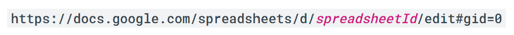

# QR-register<!-- omit from toc -->

## Table of Contents<!-- omit from toc -->

- [Getting started](#getting-started)
  - [Prerequisites](#prerequisites)
  - [Installation](#installation)
- [Usage](#usage)
  - [File formatting](#file-formatting)
    - [Google Sheets](#google-sheets)
    - [CSV](#csv)
  - [Creating QR codes](#creating-qr-codes)
  - [Initial configuration](#initial-configuration)
  - [Scanning the QR](#scanning-the-qr)
- [Troubleshooting](#troubleshooting)
- [Credits](#credits)

## Built with<!-- omit from toc -->

  

## Getting started

### Prerequisites

- Virtual Environment
  
  ```shell
  python -m venv env
  ```

- OAuth credentials - obtain from me

> [!CAUTION]  
> Sharing the credentials will allow potential malicious activites to be performed under my account. So please keep my credentials secret :sob::sob::sob:

### Installation

Just simply download this repo then move the `env` into the directory, after that open PowerShell and activate the environment with

```shell
cd env
Scripts/activate
cd ..
```

Then install the necessary libraries

```shell
python -m pip install -r requirements.txt
```

## Usage

### File formatting

#### Google Sheets

[Example](https://docs.google.com/spreadsheets/d/1UT_GerjzJCv7Bu_MnEMHZUr533mF3xe0W0rMiUlHnq4/edit#gid=650366501)

- Every delegate should have their own unique identifier
- The delegates' identifier and their attendance cell should locate on the same row.
- No merged cells should be in the delegates' row.

#### CSV

```csv
name, [...], identifier
```

- Name always be in the first column.
- Identifier always be in last column.
- Anything can be put in between these column as they will be ignored.

### Creating QR codes

1. From your spreadsheets app, download the list of delegates name and their identifier as `delegatesInfo.csv`.

2. Move the file into `QR-register/`.

3. Run `src/qrCreate.py`.

4. Delete `qrcodes/a.txt` file.

### Initial configuration

Find `src/config.json` which contains all the configuration of the program.

- camera_id: 0 (default) for webcam or 1 for back cam
- sheets_id: The ID of the Google Sheets used for attendance
  
- page: The name of the sheet where the attendance is located
- register_column: The column in which attendance will be marked
- identifier_column: The column in which the delegates' identifier are placed
- start_row: The row containing the first delegate  

Example:
To configure the program for registrating Room 1 in this [Google Sheets](https://docs.google.com/spreadsheets/d/1UT_GerjzJCv7Bu_MnEMHZUr533mF3xe0W0rMiUlHnq4/edit#gid=0), the configuration file should look as follows:

```json
{
  "camera_id": 1,
  "sheets_id": "1UT_GerjzJCv7Bu_MnEMHZUr533mF3xe0W0rMiUlHnq4",
  "page": "Room 1",
  "register_column": "G",
  "identifier_column": "C",
  "start_row": 3
}
```

### Scanning the QR

1. Move `credentials.json` into `QR-register/auth/`.

2. Run `src/main.py`.

3. If it is your first time running, a Google sign-in prompt may open. Make sure to sign in with the account that has access to your attendance spreadsheet.

4. As one scan their QR, a green frame will be drawn around it if login successful as well as their identifier appearing in green underneath.

5. Once all the delegates have registered, close the window then wait for the program to sync the data with the Google Sheets.

## Troubleshooting

Sign in with the wrong Google Account? Delete the `auth/token.json` then run `src/main.py` again.
> [!CAUTION]  
> Again, do not share this token to anyone (same reason as credentials).

QR code not registering? Make sure the QR code is perpendicular to the camera and lighting is neither too dark nor too bright.

## Credits

Program made for BISHCMC MUN club.

Idea proposal: Henry Bui  
Developer: Gia Phu
